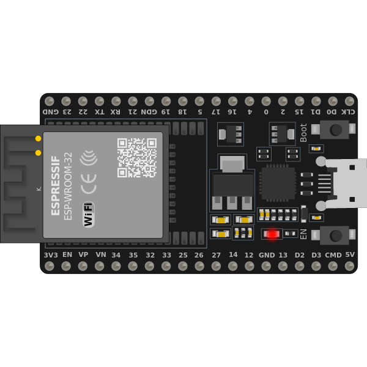

<h3 align="center">ESP32 WiFi Hijack</h3>

  
  

## Overview

The "ESP32 WiFi Hijack" project is a cybersecurity demonstration using an ESP32 microcontroller. The project creates a fake WiFi network named "Free Wifi airport," which redirects connected users to a custom login page that mimics an airport WiFi portal. The login page captures and stores the credentials (email and password) entered by the users. This project serves as an educational tool to highlight the potential security risks of connecting to unknown WiFi networks.

## Features
<ul align="left">
  <li><strong>Fake WiFi Network:</strong> The ESP32 broadcasts a WiFi network named "Free Wifi airport" without requiring a password.</li>
  <li><strong>Custom Login Page:</strong> Connected users are redirected to a login page designed to look like an official airport WiFi login portal.</li>
  <li><strong>Data Capture:</strong> The login credentials entered by the users are captured and stored in the ESP32's memory.</li>
  <li><strong>Download Feature:</strong> The stored login data can be downloaded as a text file.</li>
  <li><strong>Hidden Admin Page:</strong> An admin page is available to view the captured login data and the number of connected clients.</li>
</ul>

## Project Structure
<ul align="left">
  <li><strong>/data:</strong> Contains static files such as images (e.g., <code>plane.jpg</code>).</li>
  <li><strong>/src:</strong> Contains the main source code (<code>ESP32_WiFi_Hijack.ino</code>).</li>
  <li><strong>README.md:</strong> This file, explaining the project and how to use it.</li>
  <li><strong>.gitignore:</strong> Optional file to exclude unnecessary files from the repository.</li>
  <li><strong>LICENSE:</strong> Information about the project's license (e.g., MIT License).</li>
</ul>

## How It Works
<ol align="left">
  <li><strong>WiFi Setup:</strong> The ESP32 is configured as a WiFi Access Point (AP) with the SSID "Free Wifi airport" and no password.</li>
  <li><strong>DNS Server:</strong> A DNS server is set up to intercept DNS requests and redirect all traffic to the ESP32.</li>
  <li><strong>Web Server:</strong> The ESP32 hosts a web server that serves the custom login page and handles user requests.</li>
  <li><strong>Login Capture:</strong> When users attempt to log in via the fake portal, their credentials are captured and stored in an array.</li>
  <li><strong>Admin Access:</strong> The admin can access a hidden page to view the captured credentials and download them as a text file.</li>
</ol>

<h3 align="left">Code Explanation</h3>

<ul align="left">
  <li><strong>Initialization:</strong> The ESP32 is initialized with WiFi, DNS, and web server settings. <code>SPIFFS</code> is used to store and serve static files such as images. The Access Point is started, and the IP address is printed to the Serial Monitor.</li>
  <li><strong>Handling Requests:</strong> The following functions handle different types of requests:
    <ul>
      <li><code>handleRoot()</code>: Redirects users to the custom login page.</li>
      <li><code>handleRedirectPage()</code>: Serves the login page HTML content.</li>
      <li><code>handleLogin()</code>: Captures the username and password entered by the user and stores them in the array.</li>
      <li><code>handleHiddenPage()</code>: Displays the stored login data and the number of connected clients.</li>
      <li><code>handleDownload()</code>: Allows the admin to download the captured data as a text file.</li>
      <li><code>serveImage()</code>: Serves the image file used in the login page.</li>
      <li><code>handleNotFound()</code>: Redirects all other requests to the login page.</li>
    </ul>
  </li>
</ul>

## Setup Instructions

<h4 align="left">1. Hardware Requirements</h4>
<ul align="left">
  <li><strong>ESP32 Microcontroller:</strong> The main hardware component used in this project.</li>
</ul>

<h4 align="left">2. Software Requirements</h4>
<ul align="left">
  <li><strong>Arduino IDE:</strong> The development environment used for writing and uploading the code.</li>
  <li><strong>Libraries:</strong>
    <ul>
      <li><code>WiFi.h</code></li>
      <li><code>WebServer.h</code></li>
      <li><code>DNSServer.h</code></li>
      <li><code>SPIFFS.h</code></li>
      <li><code>base64.h</code></li>
    </ul>
  </li>
</ul>

<h4 align="left">3. Upload Files to SPIFFS</h4>
<ul align="left">
  <li>Place <code>plane.jpg</code> or any other image in the <code>/data</code> folder.</li>
  <li>Upload the image to the ESP32's SPIFFS using the "ESP32 Sketch Data Upload" tool in Arduino IDE.</li>
</ul>

<h4 align="left">4. Upload the Code</h4>
<ul align="left">
  <li>Compile and upload the <code>ESP32_WiFi_Hijack.ino</code> file to your ESP32 using Arduino IDE.</li>
</ul>

<h4 align="left">5. Connecting to the Network</h4>
<ul align="left">
  <li>Search for the "Free Wifi airport" network and connect using any WiFi-enabled device.</li>
  <li>You will be redirected to the fake login page.</li>
</ul>

## Usage
<ol align="left">
  <li><strong>Connecting to the Fake Network:</strong> When users connect to the "Free Wifi airport" network, they are automatically redirected to the login page.</li>
  <li><strong>Entering Credentials:</strong> Users are prompted to enter their email and password on the login page.</li>
  <li><strong>Accessing the Admin Page:</strong> The admin can access the hidden page by navigating to <code>/hidden-page</code> on the network to view the captured login data and connected clients.</li>
  <li><strong>Downloading Data:</strong> The captured data can be downloaded as a text file from the admin page.</li>
</ol>

## Legal Disclaimer

This project is intended for educational purposes only. Unauthorized or malicious use of this project may be illegal. The author is not responsible for any misuse of this project.

